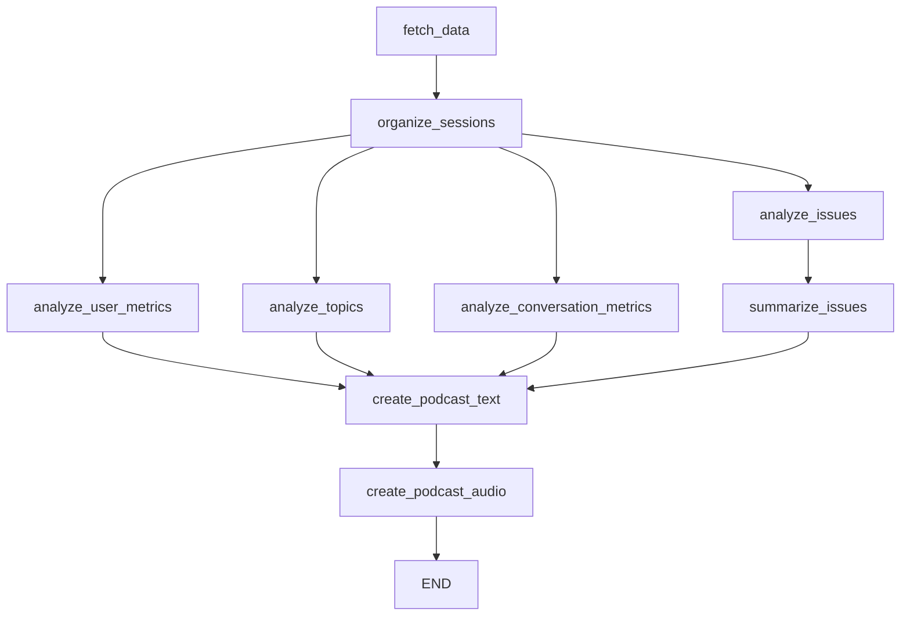
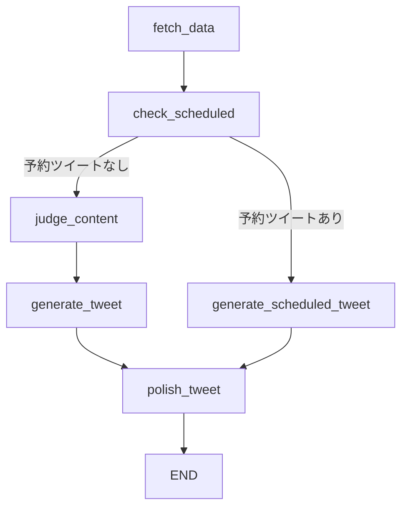

# ワークフロー図

## AITuberAnalyzer2 ワークフロー

このダイアグラムは、AITuberAnalyzer2 クラスのデータ処理フローを表しています。

### 処理フローの説明

1. データの取得（`fetch_data`）から始まり、セッションの整理（`organize_sessions`）を行います
2. `organize_sessions`から 4 つの並列分析が開始されます：
   - ユーザーメトリクス分析（`analyze_user_metrics`）
   - トピック分析（`analyze_topics`）
   - 会話メトリクス分析（`analyze_conversation_metrics`）
   - 問題分析（`analyze_issues`）
3. 問題分析の結果は要約（`summarize_issues`）されます
4. すべての分析結果がポッドキャストテキスト生成（`create_podcast_text`）に集約されます
5. テキストから音声を生成（`create_podcast_audio`）し、処理を終了（`END`）します

## TweetGenerator ワークフロー

このダイアグラムは、TweetGenerator クラスのデータ処理フローを表しています。

### 処理フローの説明

1. データの取得（`fetch_data`）
   - 会話履歴、ツイート履歴、マスターのツイート履歴を取得します
2. 予約ツイートの確認（`check_scheduled`）
   - scheduled_tweets テーブルから指定日（target_date）の予約ツイートを検索します
   - content が null でないレコードが存在する場合は予約ツイート処理へ分岐します
3. 通常のツイート生成フロー
   - コンテンツ判断（`judge_content`）
     - 会話履歴とマスターのツイートのどちらを元にツイートを生成するか判断します
   - ツイート生成（`generate_tweet`）
     - 選択されたソースを元に初期のツイートを生成します
4. 予約ツイート生成フロー
   - 予約ツイート生成（`generate_scheduled_tweet`）
     - 予約された内容に沿ったツイート文章を生成します
5. ツイートの磨き上げ（`polish_tweet`）
   - 生成されたツイート（通常/予約）をより自然な表現に磨き上げます
6. 処理終了（`END`）
